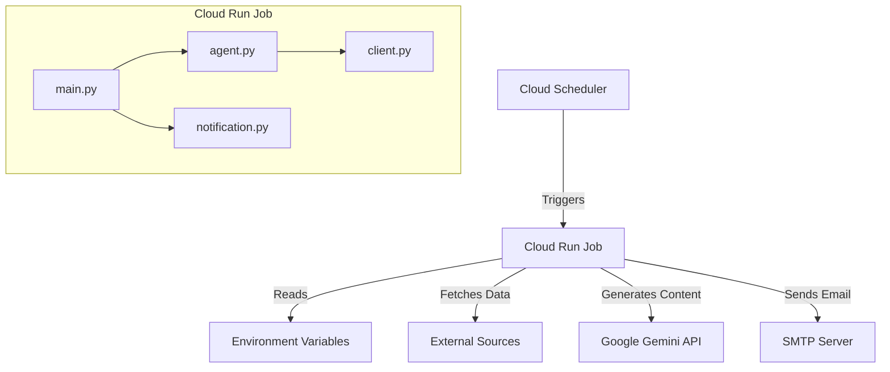

# System Architecture

This document describes the architecture of the **Reader Morning Digest** system.

## Overview

The Reader Morning Digest is a cloud-native application designed to aggregate information from various sources and generate a daily digest using Generative AI. It is deployed as a Cloud Run Job to execute on a scheduled basis.

## System Diagram

## Components

### 1. Core Application (`main.py`)
The entry point of the application. It orchestrates the workflow:
- Initializes the agent and client.
- Fetches data (currently simulated or from configured sources).
- Invokes the AI agent to generate the digest.
- Formats the output.
- Triggers the email notification.

### 2. AI Agent (`agent.py` & `client.py`)
- **Agent**: Encapsulates the logic for interacting with the LLM. It constructs prompts and handles the conversation flow.
- **Client**: Manages the low-level API calls to Google Gemini (or other configured LLMs).

### 3. Notification System (`notification.py`)
Handles the delivery of the generated digest.
- Converts Markdown content to HTML.
- Sends emails using SMTP configuration provided via environment variables.

## Data Flow

1. **Trigger**: The system starts (e.g., via Cloud Scheduler).
2. **Configuration**: Loads settings from environment variables (API keys, SMTP settings, etc.).
3. **Ingestion**: (Future) Fetches raw content from RSS feeds or APIs.
4. **Processing**: The `Agent` processes the content and requests a summary from the LLM.
5. **Generation**: The LLM returns a structured daily digest.
6. **Delivery**: The `Notification` module formats the digest as an HTML email and sends it to the configured recipient.
