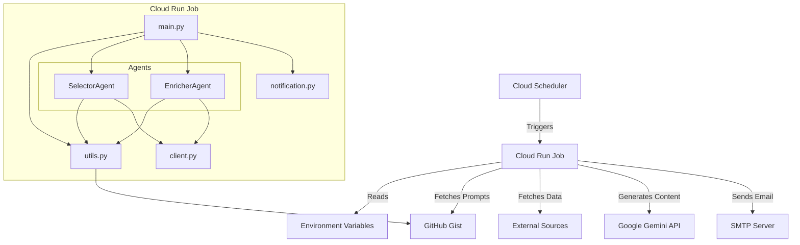

# System Architecture

This document describes the architecture of the **Reader Morning Digest** system.

## Overview

The Reader Morning Digest is a cloud-native application designed to aggregate information from various sources and generate a daily digest using Generative AI. It is deployed as a Cloud Run Job to execute on a scheduled basis.

## System Diagram

## Components

### 1. Core Application (`main.py`)
The entry point of the application. It orchestrates the workflow:
- Initializes the agent pipeline (Selector -> Enricher).
- Fetches data via the Selector agent.
- Enriches selected articles via the Enricher agent.
- Formats the output.
- Triggers the email notification.

### 2. AI Agents (`agents/`)
The logic is split into specialized agents:
- **SelectorAgent** (`agents/selector.py`): Responsible for fetching raw data and selecting the most relevant articles based on strict criteria (e.g., "Must Read", "CEO Relevance"). Uses external prompts from Gist.
- **EnricherAgent** (`agents/enricher.py`): Takes the selected articles and adds value (key takeaways, summary refinement). Uses external prompts from Gist.

### 3. Utilities (`utils.py`)
- **Prompt Fetcher**: Handles fetching agent instructions from external GitHub Gist URLs.
- **Fallback Logic**: Ensures the application runs with default prompts if external sources are unreachable.

### 4. Client (`client.py`)

### 3. Notification System (`notification.py`)
Handles the delivery of the generated digest.
- Converts Markdown content to HTML.
- Sends emails using SMTP configuration provided via environment variables.

## Data Flow

1. **Trigger**: The system starts (e.g., via Cloud Scheduler).
2. **Configuration**: Loads settings from environment variables.
3. **Prompt Loading**: Fetches the latest agent instructions from GitHub Gist (with local fallback).
4. **Ingestion**: Fetches raw content from Readwise Reader API.
4. **Processing**: The `Agent` processes the content and requests a summary from the LLM.
5. **Generation**: The LLM returns a structured daily digest.
6. **Delivery**: The `Notification` module formats the digest as an HTML email and sends it to the configured recipient.
